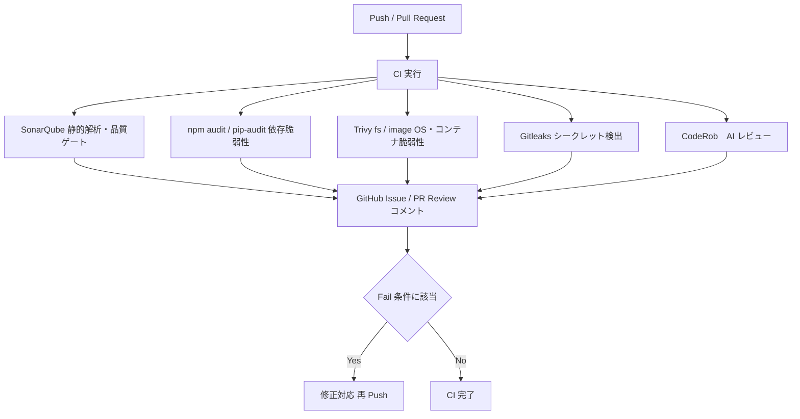

# CI アーキテクチャ

## 1. 概要

本 CI 構成では、機械的に検査可能な領域（静的解析・脆弱性診断・規約遵守・リファクタリング候補検出等）を自動化し、人間によるレビューは設計・仕様確認等の高次判断に限定することを目的とする。

Push / Pull Request 発生時に自動で複数の検査が並列実行され、結果は GitHub（Issues / PR Review / Code Scanning 等）へ集約される。

**自動検出対象（例）**
- コード品質（バグ、複雑度、重複、リファクタリング対象）
- 依存関係およびコンテナの脆弱性
- シークレット情報の誤混入
- コーディング規約違反
- AI による可読性・構造改善指摘

---

## 2. CI 全体フロー

---

## 3. 採用ツールおよび役割

| ツール | 役割 | 採用理由 |
|------|------|------|
| SonarQube | 静的解析・品質ゲート（バグ、コードスメル、複雑度、リファクタリング検出） | 再現性の高いルールベース解析 |
| npm audit / pip-audit | 依存関係脆弱性の軽量スキャン | 各言語エコシステム標準 |
| Trivy（fs / image） | OS・コンテナを含む広域脆弱性診断 | 依存検査のカバレッジ補完 |
| Gitleaks | シークレット漏洩検出 | 重大事故の未然防止 |
| CodeRob | AI コードレビュー | 組織ルールに基づく柔軟な指摘 |

**補足：SonarQube × AI レビューの役割分担**
- **SonarQube**：再現可能な静的ルール検査
- **AI**：文脈理解を伴う可読性・構造改善提案

→ 両者は相補関係にある。

---

## 4. GitHub への集約方式

| ツール | 出力形式 | 集約先 | 備考 |
|------|------|------|------|
| SonarQube | JSON / Issue | GitHub Issues | 品質台帳 |
| npm / pip audit | CLI 結果 | PR Review | 軽量 |
| Trivy | CLI + Artifact | PR Review | SARIF 化可能 |
| Gitleaks | CLI 結果 | PR Review（Fail） | 強制停止 |
| CodeRob | コメント | PR Review | 非ゲート |

---

## 5. CI 成功 / 失敗基準

| チェック | Fail 条件 | CI | 備考 |
|------|------|------|------|
| SonarQube | Quality Gate NG | 継続可 | 調整可能 |
| npm audit | CRITICAL | 停止 | HIGH 以下は警告 |
| pip-audit | 脆弱性あり | 停止 | 厳格運用 |
| Trivy | HIGH / CRITICAL | 停止 | OS 影響大 |
| Gitleaks | 検出あり | 停止 | 重大 |
| AI レビュー | Fail なし | - | 支援目的 |

---

## 6. リポジトリ別 CI 構成

### Client（QuantumMind-AgentSetting-Client）
- SonarQube（TypeScript / React）
- npm audit
- Trivy（fs / image）
- Gitleaks
- CodeRob

### Server（QuantumMind-AgentSetting-Server）
- SonarQube（Python / FastAPI）
- pip-audit
- Trivy（fs / image）
- Gitleaks
- CodeRob

